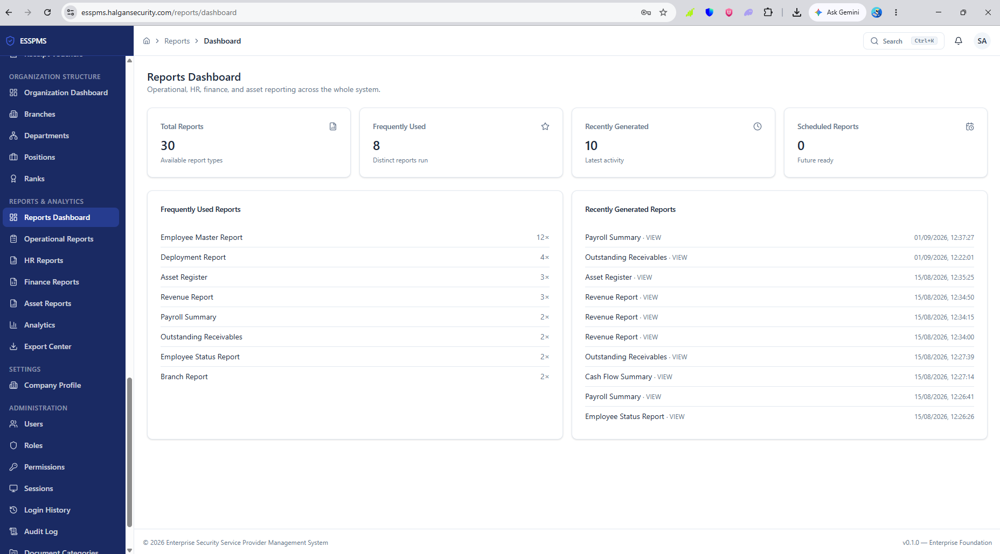

# Halgan ERP Security System

### Enterprise Security & Management Platform

A modern enterprise foundation for managing security operations, organizational workflows, users, permissions, and business management processes through a centralized web platform.

## Overview

Halgan ERP Security System is an enterprise-grade web application foundation designed to provide a secure, scalable architecture for an integrated Security Service Provider management platform.

The system is built around a modular architecture so that business domains can be developed and extended independently while sharing common authentication, authorization, data, and UI infrastructure.

## Core Capabilities

- Secure authentication and session management
- Role-based access control (RBAC)
- Permission management
- Protected application routes
- Organization and user management foundation
- Security operations architecture
- Attendance management architecture
- Employee and client management architecture
- Payroll and finance architecture
- Incident and patrol management architecture
- Reports and analytics architecture
- Document management architecture
- Notifications and system-wide search
- Reusable enterprise UI components

## Technology Stack

| Technology | Purpose |
|---|---|
| Next.js 15 | Application framework |
| React 19 | User interface |
| TypeScript | Type-safe development |
| Supabase | Backend services and authentication |
| PostgreSQL | Relational database |
| Tailwind CSS | UI styling |
| TanStack Query | Server-state management |
| TanStack Table | Data tables |
| React Hook Form | Form management |
| Zod | Validation |
| Framer Motion | UI animations |
| Recharts | Data visualization |

## Architecture

The application follows a modular enterprise architecture:

```text
src/
├── app/
├── components/
│   ├── ui/
│   ├── shell/
│   └── shared/
├── modules/
├── providers/
├── services/
├── lib/
│   └── supabase/
├── hooks/
├── types/
├── constants/
└── middleware.ts


**isla markiiba kadib:**

```text
└── middleware.ts

``````````````````````````````````````````````````````

## Platform Screenshots

The following screenshots demonstrate the current enterprise application interface and key management modules.

### Main Dashboard


### Executive Dashboard


### Executive Analytics


### Executive Operations & Analytics


### Finance Management


### Operational Reporting


### Payroll Management


### Reports Dashboard


### Role-Based Access Control

